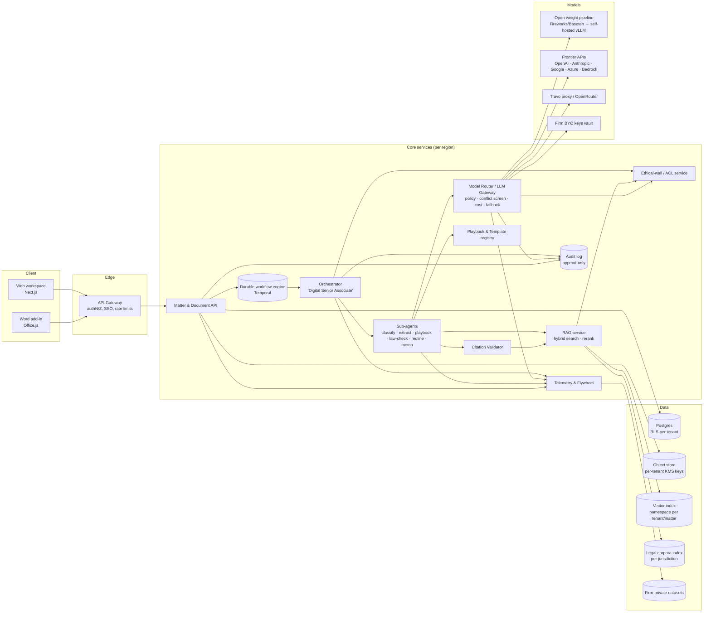

# 02 — System Architecture

> **Status:** Draft v1 · **Last updated:** 2026-09-29 · **Related:** [03](03-model-routing-and-hybrid-inference.md), [04](04-legal-rag-and-citation-validation.md), [06](06-security-compliance-ethical-walls.md), [10](10-tech-stack.md)

## 1. Principles
1. **Model-agnostic core.** No business logic calls a vendor SDK directly; every model call goes through the Router (ADR-002).
2. **Matter is the security boundary.** Every document, embedding, prompt, log line and dataset row carries `tenant_id` + `matter_id`; access is checked at every layer.
3. **Evidence before assertion.** Generated legal claims pass through the Citation Validator before a user can mark them final.
4. **Durable, resumable agents.** Multi-hour reviews run as durable workflows (checkpointed, retryable, human-pausable).
5. **Everything is telemetry.** Every agent step, routing decision and human correction is an event.

## 2. Component view

## 3. Request lifecycle — "Review this contract"
1. User uploads DOCX/PDF to Matter M (Web or Word). Gateway authenticates (SSO/OIDC), resolves tenant, checks the user is inside M's ethical wall.
2. Document API stores the file encrypted with the tenant key, emits `document.uploaded`.
3. Ingestion: parse (DOCX structure / PDF layout + OCR), language detection, section/clause segmentation, embeddings into namespace `tenant/M`.
4. Workflow engine starts `ContractReviewWorkflow(M, doc, playbook?)` — see [05](05-contract-review-workflow.md).
5. Orchestrator plans steps; each sub-agent asks the Router for a model with a **Task Descriptor** (task type, tokens, jurisdiction, sensitivity, matter conflict profile).
6. Router applies policy, chooses a model/endpoint (open-weight by default), records a `RoutingDecision`, calls it, handles fallback/escalation.
7. Law-check and memo agents retrieve from legal corpora + firm knowledge; every claim goes through the Citation Validator.
8. Results (findings, redlines, citations, confidence) are persisted; UI streams progress.
9. Lawyer reviews; accept/edit/reject events flow to Telemetry → firm-private datasets.

## 4. Deployment topology
| Stage | Topology |
|---|---|
| P0–P2 | Multi-tenant SaaS in **Singapore** region (AWS ap-southeast-1 or GCP asia-southeast1). Logical isolation (RLS, per-tenant keys, per-tenant vector namespaces). Open-weight inference via Fireworks AI / Baseten dedicated deployments with zero retention. |
| P2+ | **Vietnam-local cell** (local DC/cloud partner such as Viettel IDC/FPT Cloud/VNG Cloud `[verify]`) and **Indonesia cell** (AWS/GCP Jakarta) for residency-sensitive firms. Cells are identical stacks, data never crosses cells by default. |
| P4 | Travo-controlled GPU inference (vLLM/SGLang on H100/H200/B200 class or cloud reservations) per region; **single-tenant / on-prem** option for large firms. |

## 5. Cross-cutting concerns
- **Identity:** OIDC/SAML SSO (Entra ID, Google Workspace, Okta), SCIM provisioning, MFA.
- **Secrets:** BYO keys stored in a KMS-backed vault, scoped to tenant, never logged.
- **Observability:** OpenTelemetry traces with `tenant_id`, `matter_id` as attributes; prompt/response bodies stored only in the tenant's encrypted store, never in shared APM.
- **Resilience:** Router-level provider failover; durable workflows resume after crash; idempotent sub-agent steps.
- **Cost control:** per-matter and per-tenant budgets enforced by the Router.
