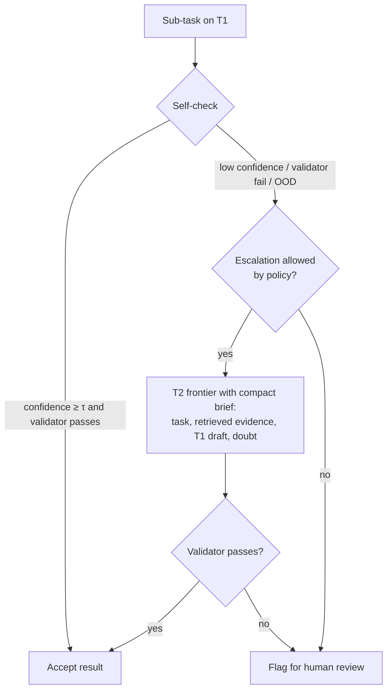

# 03 — Model Routing & Hybrid Inference

> **Status:** Draft v1 · **Last updated:** 2026-09-29 · **Related:** [02](02-system-architecture.md), [06](06-security-compliance-ethical-walls.md), [07](07-hitl-telemetry-data-flywheel.md)

## 1. Why a neutral router
Law firms face **conflict risk** if their core infrastructure depends on a single
AI provider. A firm representing an AI lab (e.g., in a copyright or antitrust
dispute) may be unable — ethically, contractually or by client instruction — to
send that matter's data to the opposing lab, or even to be seen depending on it.
Clients also increasingly issue outside-counsel guidelines restricting which AI
tools may touch their files.

Travo's router makes model choice a **policy**, set per tenant, per client and
per matter, rather than a hard-coded dependency. Benefits:
- **Conflict mitigation:** per-matter provider blocklists/allowlists enforced at call time.
- **No vendor lock-in:** swap or add providers without changing workflows.
- **Cost:** long, token-heavy work goes to cheap open-weight models.
- **Quality:** hard sub-tasks escalate to the best frontier model allowed.
- **Sovereignty:** residency-restricted matters use only in-region / self-hosted endpoints.

## 2. Model tiers
| Tier | Examples (swap freely) | Used for |
|---|---|---|
| **T0 — Utility** | small open-weight (e.g., 7–14B class), embedding & reranker models | classification, language ID, segmentation, embeddings, rerank, PII detection |
| **T1 — Travo Domain (open-weight, post-trained)** | 30–120B-class open-weight base (Qwen / Llama / Mistral / Gemma / DeepSeek families) + Travo legal SFT/DPO + optional **per-firm LoRA adapter** | clause extraction, playbook comparison, first-pass risk findings, routine drafting & redlines, long multi-hour reviews, summarisation |
| **T2 — Frontier** | latest GPT, Claude, Gemini models (via BYO key or Travo proxy) | ambiguous multi-jurisdictional reasoning, novel clause structures, complex multimodal documents, final memo synthesis on high-stakes matters, judge/validator on escalated items |

### Vendors vs hosts
Each endpoint records the model **vendor** (`provider`, whose model runs) and the **host or
aggregator** it goes through (`via`: Fireworks, Baseten, OpenRouter). Both see the data, so
deny lists and matter conflict profiles apply to both: denying `anthropic` also blocks
Anthropic models reached via OpenRouter. Travo's own models (`provider: travo`) count as first
party: they pass "only these vendors" allowlists, but can still be denied explicitly.

## 3. Task Descriptor (router input)
```json
{
  "task_type": "clause_extraction | playbook_compare | law_check | redline | memo | classify | embed | rerank | validate_claim",
  "tenant_id": "t_123",
  "matter_id": "m_456",
  "jurisdictions": ["SG", "VN"],
  "languages": ["en", "vi"],
  "est_input_tokens": 48000,
  "est_output_tokens": 4000,
  "sensitivity": "standard | high | restricted",
  "latency_class": "interactive | batch",
  "quality_floor": "standard | high",
  "requires": ["tool_use", "long_context", "vision"],
  "attempt": 1,
  "escalation_reason": null
}
```

## 4. Policy evaluation (ordered)
1. **Hard constraints (filter):**
   - Matter **conflict profile**: blocked providers/model families (e.g., `block: [openai]` for a matter adverse to OpenAI).
   - Client outside-counsel AI restrictions (allowlist of providers / "no third-party AI").
   - **Residency**: `restricted` → only endpoints in the matter's region cell or self-hosted.
   - Tenant billing mode: BYO key available for provider X? Travo proxy enabled?
   - Capability requirements (context length, vision, tool use).
2. **Default choice:** lowest-cost tier meeting `quality_floor` for `task_type` (from a routing table learned from evals, see [11](11-evaluation-and-quality.md)).
3. **Budget:** if per-matter budget would be exceeded, downgrade within quality floor or pause and ask the user.
4. **Fallback:** on provider error/timeout → next eligible endpoint in same tier → lower tiers → higher tiers allowed by the rule. On an **escalation**, lower tiers are excluded (they already failed).
5. **Record** a `RoutingDecision` (inputs, candidates, filtered-out reasons, chosen, cost, latency) — visible to admins and in the UI's "why this model" panel.

Policy is expressed as versioned YAML per tenant (with matter overrides) and evaluated by a small deterministic engine (no LLM in the policy path):

```yaml
tenant: t_123
billing: { mode: byo_keys, fallback_to_proxy: false }
providers:
  allow: [anthropic, google, travo_openweight]
  deny: []
defaults:
  clause_extraction: { tier: T1 }
  playbook_compare: { tier: T1, adapter: firm_t123_v7 }
  law_check:        { tier: T1, escalate_to: T2 }
  memo:             { tier: T2, when: "sensitivity == 'high'" }
matter_overrides:
  m_456:
    conflict: { deny_providers: [openai] }
    residency: VN
budgets: { per_matter_usd: 300, per_month_usd: 20000 }
```

## 5. Agent-in-the-loop escalation ("asks for help")
The T1 domain model is the *digital senior associate*; it escalates only when needed.



**Escalation triggers:**
- Calibrated confidence below threshold τ (per task type; calibrated on eval sets).
- Citation Validator reports unsupported/contradicted claims after one retry.
- Out-of-domain classifier: unfamiliar contract type, jurisdiction not in packs, unusual language mix.
- Disagreement between T1 and a cheap second sample (self-consistency).
- Explicit user request ("second opinion").

**Escalation brief** minimises data sent to T2: only relevant clauses + evidence, with optional redaction of party names (pseudonymisation map kept in-tenant).

Escalations are logged and become training signal: every T2 fix on a T1 failure is a candidate SFT/DPO example (tenant consent rules in [07](07-hitl-telemetry-data-flywheel.md)).

## 6. Billing modes
| Mode | How it works | Notes |
|---|---|---|
| **BYO keys** | Firm stores provider keys (OpenAI, Anthropic, Google, Azure OpenAI, AWS Bedrock, Vertex). Router calls with the firm's key. | Firm's own enterprise terms and zero-retention agreements apply. Travo never stores prompts at provider. |
| **Travo proxy** | Router calls via Travo's gateway → OpenRouter-compatible aggregator or direct Travo contracts; usage metered and billed as Travo Tokens. | Travo negotiates zero-retention; simpler for small firms. |
| **Travo open-weight** | T0/T1 always billed via Travo (hosted by Travo on Fireworks/Baseten → self-hosted). | Main margin driver. |

## 7. Infrastructure evolution
| Stage | Open-weight hosting | Frontier access | Why |
|---|---|---|---|
| **Early (P0–P2)** | Fireworks AI / Baseten dedicated deployments (LoRA multi-adapter serving), SG region, zero retention | BYO keys + proxy | Fastest time to market, no GPU ops |
| **Growth (P3)** | Same + reserved capacity; start training pipeline (SFT/DPO/LoRA) on managed GPUs | + direct enterprise contracts | Control of domain model |
| **Scale (P4)** | Travo-controlled clusters (vLLM/SGLang) per region cell; on-prem/VPC appliance for large firms | APIs as escalation only | Full command of privacy, security, latency and unit cost |

The gateway exposes one **OpenAI-compatible internal API** (e.g., LiteLLM-style) so moving from Fireworks to self-hosted is a config change.

## 8. Router SLOs
- Policy decision overhead p99 < 20 ms.
- Zero calls to a denied provider (tested by contract tests + audit queries).
- Provider failover < 5 s for interactive tasks.
