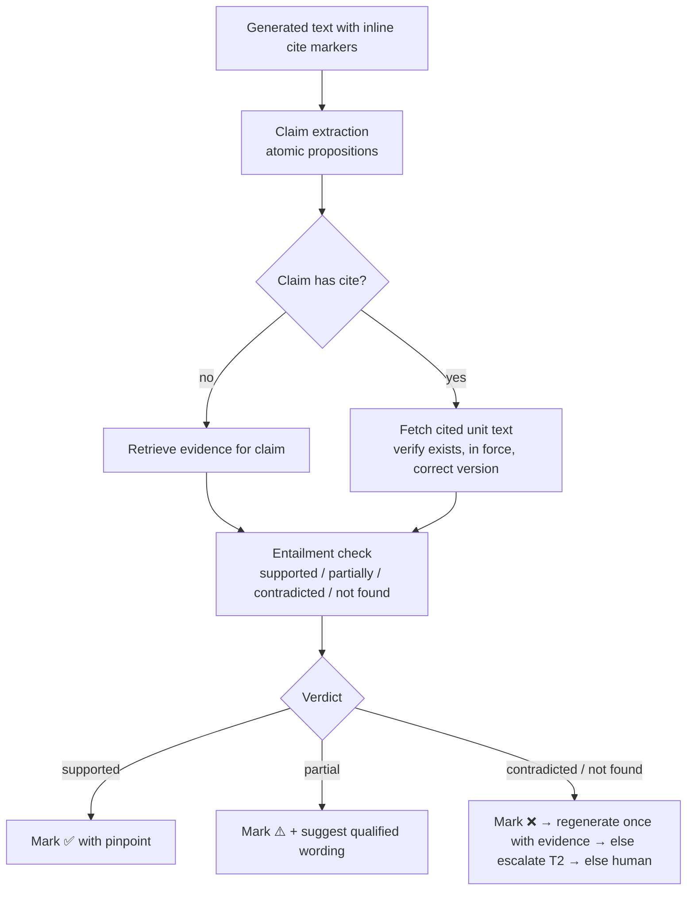

# 04 — Legal RAG & Per-Claim Citation Validation

> **Status:** Draft v1 · **Last updated:** 2026-09-30 · **Related:** [02](02-system-architecture.md), [05](05-contract-review-workflow.md), [11](11-evaluation-and-quality.md)

## 1. Goal
Eliminate ungrounded legal assertions. Every legal proposition Travo outputs must
be (a) supported by a retrieved source, (b) pinpoint-cited, and (c) machine-checked
for entailment. Unsupported claims are visibly flagged and **cannot be exported as
final** without a lawyer's explicit override (logged).

## 2. Knowledge sources
| Layer | Content | Scope |
|---|---|---|
| **Public primary law** | Statutes, subsidiary legislation, decrees, circulars, regulations; court judgments where public | Shared across tenants (read-only) |
| **Licensed databases** | Commercial reporters/commentary via partnership APIs | Shared, license-gated per tenant |
| **Firm knowledge** | Playbooks, precedents, clause banks, prior memos, templates | Tenant-private |
| **Matter documents** | The contracts under review, correspondence | Matter-private (ethical wall) |

### Jurisdiction packs (initial sources — confirm licensing, see [13](13-open-questions.md))
| Jurisdiction | Public | Licensed / partner candidates |
|---|---|---|
| Singapore | Singapore Statutes Online (sso.agc.gov.sg), Supreme Court judgments, PDPC decisions | LawNet (SAL), LexisNexis SG `[verify]` |
| Malaysia | Laws of Malaysia (AGC portal), Federal Gazette, e-Court judgments | CLJ Law, Lexis MY `[verify]` |
| Vietnam | National Legal Database (vbpl.vn), Official Gazette (congbao), court precedents (anle.toaan.gov.vn) | Thư Viện Pháp Luật, LuatVietnam `[verify]` |
| Indonesia | JDIH / peraturan.go.id, BPK JDIH database, Supreme Court decisions (putusan3.mahkamahagung.go.id) | Hukumonline Pro `[verify]` |
| Cross-border | UNCITRAL, CISG, SIAC/KLRC/VIAC/BANI rules, ASEAN instruments | — |

Each legal document is stored with metadata: `jurisdiction, instrument_type, number, title, issuing_body, effective_date, expiry/amended_by, status (in force / partly / repealed), language, official_url, version_hash`.

**Temporal validity** is first-class: retrieval filters by the date relevant to the contract (signing date or "as of today"), and amendment chains are tracked so repealed provisions are never cited as current.

## 3. Ingestion & indexing
1. Fetch → normalise (HTML/PDF → structured text) → detect structure (Part/Chapter/Article/Clause/Point for VN/ID; Part/Section/Subsection for SG/MY).
2. **Chunk by legal unit** (article/section), preserving hierarchy path (e.g., `VN/Law 91/2015/QH13 (Civil Code)/Art. 418/Cl. 1`). Chunks carry parent context summary.
3. Dual indexing: **BM25** (exact terms, article numbers, defined terms) + **dense vectors** (multilingual embedding model supporting en/vi/id/ms).
4. Cross-lingual support: store official language + machine translation (EN) side-by-side; cite the official language text, show translation as aid.
5. Knowledge-graph edges: `amends`, `implements`, `repeals`, `cites`, `defines` — used for query expansion (e.g., Law → implementing Decree → guiding Circular).

## 4. Retrieval pipeline

- ACL filtering happens **inside the retrieval service** (namespace + metadata filter), never only in the prompt.
- Evidence pack items carry stable IDs used for citations: `src:<doc_id>#<unit_path>@<version_hash>`.

## 5. Per-claim citation validation
Applied to all generated text that makes legal or factual assertions (findings, law-check notes, memos, redline rationales).

**Checks per citation:**
1. **Existence** — the cited instrument/unit exists in the index (no invented case names or article numbers).
2. **Validity** — in force at the relevant date; not repealed/superseded.
3. **Pinpoint accuracy** — the article/section actually contains the proposition.
4. **Entailment** — NLI model (T1 fine-tuned verifier; T2 judge on escalation) confirms the claim follows from the text.
5. **Quote fidelity** — quoted text matches source verbatim (string match on normalised text).

**Outputs:** each claim gets `{status, source_ids, pinpoint, confidence, checker_model, checked_at}` stored as `Citation` rows ([09](09-data-model-and-apis.md)). UI renders a citation chip; the export gate blocks ❌ claims unless overridden with a reason.

## 6. Firm-knowledge grounding
- Playbook positions are retrieved as structured records (not free text) so the playbook agent compares clause ↔ position deterministically where possible.
- Precedents and clause banks are retrieved for redline suggestions; the suggestion cites the precedent clause it is based on.

## 7. Quality targets
| Metric | Target (P1) | Target (P3) |
|---|---|---|
| Citation existence accuracy | 100% (hard check) | 100% |
| Citation precision (supported/total shown as ✅) | ≥ 95% | ≥ 98% |
| Unsupported claims reaching export without override | 0 | 0 |
| Retrieval recall@10 on golden legal questions | ≥ 85% | ≥ 92% |

## 8. As built — P1 slice 1 (2026-09-29)
- Shared tables `legal_sources` / `legal_units` (no tenant data; app role read-only; loaded by
  `travo_api.cli ingest-legal <jsonl>` on the owner connection). Format: `travo_rag/legal_index.py`.
- Retrieval: Postgres full-text (`simple` config, GIN) with jurisdiction + in-force filters
  (status, effective_from/to at the as-of date), lexical-overlap rerank. `DenseRetriever` hook
  and reciprocal-rank fusion are in place for pgvector.
- Citation markers: `[[src:<unit_id>]]`, unit id = `<source_id>#<unit_path>`. Statuses:
  `supported`, `partial`, `contradicted`, `not_found`, `uncited`, `invalid_source`,
  `not_in_force`, `misquoted`. Only `supported` passes.
- **Corpus status:** only the test fixture corpus exists (`tests/fixtures/legal_fixture.jsonl`,
  every source titled "FIXTURE — not law"). SG/MY portals were unreachable from the dev
  environment; no statute text was transcribed from memory (ADR-014).

## 9. As built — official-source pipeline and lawyer verification (2026-09-30, ADR-019)
Pipeline (`services/rag/travo_rag/sources/`), run with `travo_api.cli legal-fetch`:
1. **Manifest** — `config/legal_sources/{sg,my}.yaml` lists instruments (id `SG/UCTA1977`, title,
   official URL or `null`, format `sso_html` | `pdf` | `text`, `expect_title`). URLs are
   `[verify]`; entries with `url: null` are reported as `needs_url`, never guessed.
2. **Polite fetch** — honours robots.txt (a 5xx or unreachable robots.txt means *do not fetch*),
   ≥ 2 s between requests, retries 429/5xx with backoff, 30 MB cap, and a User-Agent with
   contact details (`TRAVO_FETCH_CONTACT`).
3. **Raw snapshots** — every download is stored unchanged under `TRAVO_LEGAL_SNAPSHOT_DIR`
   (`.data/legal_snapshots/<id>/<timestamp>.<ext>` + `.meta.json` with URL, sha256, time,
   content type). Snapshots are not committed (licensing, Q2). `--offline` re-parses the latest
   snapshot, and refuses one whose sha256 no longer matches its metadata.
4. **Parse** — HTML → text lines (navigation, breadcrumbs, footnotes, amendment notes and
   tables of contents are dropped); PDF → pypdf text. A shared splitter finds numbered sections
   (`2.`, `2A.`, `75. —`). It drops running headers/footers (short lines repeated ≥ 3 times),
   page numbers and the "Arrangement of Sections" list. It stops at schedules or legislative
   history, uses a preceding short line as the section heading, and keeps the longest text
   when a number repeats. The "current version as at" / "reprint as at" date becomes
   `effective_from`.
5. **Guards** — the parse fails if `expect_title` is not on the page, or if fewer than 3
   sections are found. Warnings are recorded for duplicates and a missing version date.
6. **Outputs** — `out/legal/<JUR>.jsonl` (ingestion format) and `out/legal/<JUR>-review.md`
   (status table, warnings, and sample sections with official URL and sha256 for a lawyer
   to compare against the portal).

**Verification gate.**
- `legal_sources` carries `review_status` (`unverified` | `verified`), `verified_by`,
  `verified_at`, `verification_note`, `snapshot_sha256` and `retrieved_at` (migration 0004).
- Ingested sources start `unverified`. `legal-verify SOURCE_ID --by EMAIL` records the
  lawyer's check.
- Re-ingesting a source whose snapshot sha256 changed resets it to `unverified`, because
  new text needs a new check.
- With `TRAVO_REQUIRE_VERIFIED_SOURCES=true` (required for pilots and production),
  retrieval ignores unverified sources, so law checks fall back to `no_sources` → human.
- The sources drawer shows "Not yet checked by a lawyer" for unverified, non-fixture units.
- `GET /v1/legal-units/{id}` returns the status and provenance.

**Limits.**
- Parsers were tested only on synthetic pages that imitate the portal layouts. The real
  SSO HTML structure and AGC PDF layout must be confirmed on first run `[verify]`.
- Portal terms of use: confirmed (Q11, ADR-020); raw files stay out of git.
- Operating steps: [runbooks/legal-ingestion.md](runbooks/legal-ingestion.md).

### 9.1 Hardened on real AGC reprints (2026-09-30, ADR-020)
Tested on four real Malaysian reprints:
- Contracts Act 1950 (Act 136)
- PDPA 2010 (Act 709)
- Act 347
- Act 237 (Malay)

On those files the first parser silently dropped wrapped lines. It also treated contents
entries as sections and missed Malay layouts. The splitter now works as follows:
- **Page-aware chrome removal.** Running headers and footers are dropped only at page edges, when
  their shape (digits normalised) repeats on ≥ 30% of pages. Rule lines are dropped too.
  Removed shapes are listed in the report.
- **Footnotes set aside.** `*NOTE—…` lines up to the end of the page are editorial notes. They
  attach to the section with the `*` marker on that page, appear in the report and are not
  ingested.
- **Contents-driven sections.** The contents table ("Arrangement of Sections" / "Susunan
  Seksyen") is parsed into entries plus Part/Division lines.
  - In the body, a numbered line starts a section only in contents order. A jump ahead is
    accepted only if the heading matches.
  - Numbered list items therefore stay in the text.
  - The heading and Part lines above each section are matched against the contents text.
    - Case, spacing and punctuation are ignored.
    - A match of ≥ 0.9 similarity is accepted, because contents tables have typos (four in
      Act 136). The difference is reported and the body wording is kept.
- **Paragraphs.** Subsection side notes and "ILLUSTRATION(S)" labels stay on their own lines.
  Illustrations and Explanations remain part of the section text.
- **End markers.** Upper-case lines only: SCHEDULE / JADUAL, APPENDIX, LIST OF AMENDMENTS,
  SEKSYEN YANG DIPINDA, DICETAK OLEH. Schedules and appendices are not ingested yet.
- **No silent loss.** An accounting check compares every body character with what was placed:
  headings, text, Part labels, notes or preamble.
- **Version date.** Read from "Incorporating all amendments up to …", "As at …" and "Sebagaimana
  pada …" (Malay months). A text dated more than 5 years ago gets a stale-reprint warning.
- **Title check.** Ignores spacing, because pypdf splits words ("PARLIAMEN t"). PDF metadata
  titles are also accepted.
- **Supplied files.** `legal-import FILE --id MY/ACT136 [--url https://…]` stores a file someone
  downloaded from the portal as a snapshot with `origin: supplied`. An instrument without a URL
  is parsed from its latest snapshot. The report says "supplied file — add the official URL".
- **Attribution.** The API returns `issuing_body`. The sources drawer shows "Source text
  published by …" for real sources, and links the official URL only if it is `https://`.
- **Tests.**
  - Synthetic AGC-style and Malay layouts in `tests/test_legal_sources.py`.
  - `tests/test_legal_real_pdfs.py` checks the four real reprints: section numbers equal the
    contents, zero unplaced characters, headings match, text starts with the PDF's own numbered
    line, and Act 136 goes through ingest → retrieval → API. It runs only when
    `TRAVO_REAL_LEGAL_DIR` points at the PDFs.

**Status (2026-09-30):**
- MY/ACT136 and MY/ACT709 are parsed (191 and 146 sections) and unverified.
- The Contracts Act text is as at 1 Jan 2006, and the PDPA text as at 1 Jul 2023, which is before
  the 2024 amendments `[verify]`.
- Current reprints and official URLs are needed before a lawyer runs `legal-verify`.

## 10. As built — Vietnamese legislation (2026-09-30)
- **Manifest:** `config/legal_sources/vn.yaml` lists 15 launch instruments (`format: vbpl_html`,
  `language: vi`). Each has `url: null` until it is discovered on the VPS; the VN domains are
  blocked in the dev network.
- **Parser** (`travo_rag/sources/parsers_vn.py`):
  - NFC normalisation; files in legacy TCVN3/VNI fonts are refused.
  - Grammar: `Phần/Chương/Mục` → part, `Điều N.` → unit, with khoản/điểm kept in the text.
  - Only consecutive article numbers start units, so quoted references stay text.
  - Notes, closing formula and signature go to their own buckets; the effective date comes
    from "có hiệu lực thi hành từ ngày …".
  - Same accounting check as ADR-020.
- **Retrieval:** NFC queries; two-letter syllables kept; stop words in English and Vietnamese;
  matches on the accented and unaccented tsvectors combined.
- **Pinpoints:** "Điều 2 Luật …". Citation checks normalise to NFC.
