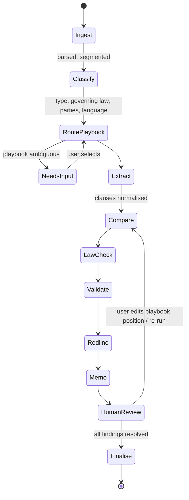

# 05 — Contract & Agreement Review Workflow (MVP)

> **Status:** Draft v1 · **Last updated:** 2026-09-29 · **Related:** [03](03-model-routing-and-hybrid-inference.md), [04](04-legal-rag-and-citation-validation.md), [08](08-ux-ui-spec.md)

## 1. Workflow overview

Implemented as a durable workflow (`ContractReviewWorkflow`); each state is an idempotent activity that can be retried, paused or resumed. Multi-document matters run one child workflow per document plus an aggregation step (cross-document consistency, e.g., definitions across SPA and disclosure letter).

## 2. Agents (the "digital senior associate" team)
| Agent | Responsibility | Default tier | Tools |
|---|---|---|---|
| **Orchestrator** | Plans steps, tracks state, decides re-runs/escalations, writes status updates | T1 | all sub-agents, router, workflow API |
| Ingest agent | Parse DOCX/PDF, OCR, language detection, clause segmentation | T0 + OCR | parser, OCR |
| Classifier | Contract type, governing law, dispute forum, parties/roles, language(s), signing date | T0/T1 | taxonomy |
| Playbook router | Select firm playbook + jurisdiction pack + client-specific overrides | deterministic + T1 | playbook registry |
| Clause extractor | Map text to clause taxonomy, extract key terms (caps, durations, amounts, notice periods) | T1 | taxonomy, schema |
| Playbook comparator | Classify each clause: standard / acceptable fallback / non-standard / missing; severity | T1 (+ firm adapter) | playbook records |
| Law-check agent | Local-law issues (enforceability, mandatory provisions, licensing, language requirements, data-protection) | T1 → T2 on escalation | RAG, citation validator |
| Redline drafter | Tracked-change proposals + rationale, based on playbook fallback language and precedents | T1 | clause bank, DOCX writer |
| Memo writer | Issues list, executive summary, negotiation points | T1; T2 for `high` sensitivity | templates |
| Validator | Per-claim citation validation ([04](04-legal-rag-and-citation-validation.md)) | T1 verifier / T2 judge | RAG |

## 3. Template / playbook routing
Playbooks are structured, versioned objects:
```yaml
playbook: nda_mutual_sg
version: 12
applies_to: { contract_types: [NDA], governing_law: [SG, MY], side: [discloser, recipient, mutual] }
clauses:
  - key: confidentiality_term
    standard: "Obligations survive for 3 years after termination"
    fallbacks: ["2 years minimum", "Trade secrets: indefinite"]
    unacceptable: ["less than 1 year"]
    severity_if_breached: high
    redline_template: clause_bank/nda/confidentiality_term_3y
    law_refs: []
  - key: governing_law
    standard: "Singapore law, SIAC arbitration"
    fallbacks: ["Singapore courts"]
    severity_if_breached: medium
```
Routing precedence: **client override → practice-group playbook → firm default → Travo starter pack**. Travo ships starter packs (NDA, MSA, SaaS, DPA, distribution, employment, lease, facility agreement, SPA/SHA) per jurisdiction that firms clone and edit.

## 4. Jurisdiction-specific checks (examples for starter packs)
| Jurisdiction | Example automated checks |
|---|---|
| SG | Penalty vs liquidated damages doctrine; Unfair Contract Terms Act exclusion limits; PDPA transfer clauses; SIAC clause validity. |
| MY | Contracts Act 1950 s.75 (penalty/compensation); stamp duty implications flagged; PDPA 2010 (as amended 2024) cross-border transfer; Malay-language requirements for certain filings. |
| VN | Civil Code 2015 & Commercial Law 2005 penalty caps (commercial penalty ≤ 8% of breached obligation value); governing-law limits for purely domestic contracts; Decree 13/2023 / PDPL personal-data clauses; Vietnamese-language version requirements for specific contract types. |
| ID | Law 24/2009 Indonesian-language requirement; PDP Law 27/2022 provisions; foreign-ownership (Positive Investment List) flags; governing law/forum practice. |

(All checks are expressed as retrievable rules with citations, owned by the jurisdiction pack, and validated by local counsel partners — see [13](13-open-questions.md).)

## 5. Bilingual contracts
- Parallel-text alignment (EN ↔ VI/ID/MS) at clause level.
- Discrepancy detection: flags where language versions differ in meaning (numbers, obligations, conditions).
- Prevailing-language clause checked and highlighted.

## 6. Outputs
1. **Findings list** (per clause): position, severity, playbook reference, law citations, confidence, suggested action.
2. **Redlined DOCX** with tracked changes and comments authored as "Travo (draft)".
3. **Review memo / issues list** (DOCX, firm template).
4. **Tabular extraction** (CSV/XLSX) for multi-document matters.

## 7. Human-in-the-loop checkpoints
- Playbook selection confirmation when classifier confidence < threshold.
- Every finding requires human disposition before export (accept / edit / reject / defer) — batch-accept allowed for low-severity standard findings.
- Export gate: no unresolved ❌ citations; override requires reason (audited).

## 8. Performance budget (30-page contract)
| Step | Target p50 |
|---|---|
| Ingest + classify | 30 s |
| Extract + compare | 90 s |
| Law check + validate | 90 s |
| Redline + memo | 60 s |
| **Total** | **≤ 4.5 min** (streamed progressively) |
