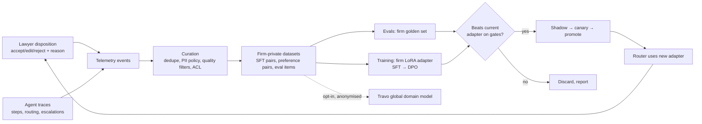

# 07 — Human-in-the-Loop, Telemetry & Data Flywheel

> **Status:** Draft v1 · **Last updated:** 2026-09-29 · **Related:** [03](03-model-routing-and-hybrid-inference.md), [08](08-ux-ui-spec.md), [11](11-evaluation-and-quality.md)

## 1. Concept
Every time a firm's lawyers accept, edit or reject Travo's work, Travo learns how
*that firm* executes complex, multi-jurisdictional legal tasks. This produces a
compounding, **firm-private** advantage: the more a firm uses Travo, the more
Travo behaves like that firm's own senior associate.

## 2. What is captured
| Event | Fields | Use |
|---|---|---|
| `finding.dispositioned` | finding_id, action (accept / edit / reject / defer), edited_text, reason_code, free-text reason, time_spent, user role/seniority | preference pairs, playbook drift signals |
| `redline.edited` | original suggestion, final text (diff), clause key | SFT pairs for redline drafter |
| `playbook.changed` | diff, author, rationale | playbook versioning, re-eval triggers |
| `citation.overridden` | claim, verdict, override reason | validator improvement, retrieval gaps |
| `routing.decision` | task descriptor, chosen model, cost, latency, outcome | routing table learning |
| `escalation.completed` | T1 draft, T2 output, validator verdicts | distillation data (T2 → T1) |
| `agent.step` | inputs/outputs refs, tool calls, durations, errors | debugging, eval replay |

**Reason codes** (short list, customisable): `wrong_clause_type`, `playbook_misapplied`, `law_incorrect`, `law_outdated`, `too_aggressive`, `too_lenient`, `drafting_style`, `missing_issue`, `not_relevant_to_client`.

## 3. Expert weighting
Corrections are weighted by the reviewer's role (partner > senior associate > junior) and by agreement: if a partner later reverses a junior's edit, the partner's version wins. Designated **"Expert reviewers"** (configured per practice group) produce gold-standard labels.

## 4. Governance & consent
| Data use | Default | Control |
|---|---|---|
| Firm-private evals and adapters | **On** (contract default) | Tenant admin can disable |
| Walled matters used for training | **Off** | Requires KM/risk approval per matter |
| Contribution to Travo global model | **Off** | Explicit opt-in; only anonymised, de-identified, playbook-level patterns; revocable |
| Client-level exclusion | Supported | Client AI policy can forbid training on its matters |

Deletion requests propagate: removed data triggers adapter retraining at next cycle; lineage tracked (dataset version → adapter version).

## 5. Training pipeline (P3+)
1. **Data build:** nightly curation into versioned datasets (`firm_t123/nda_redlines/v14`).
2. **Train:** LoRA SFT on accepted/edited outputs; DPO on (rejected, edited) pairs; distillation from T2 escalations.
3. **Eval:** firm golden set + Travo global regression suite ([11](11-evaluation-and-quality.md)); must not regress safety/citation metrics.
4. **Deploy:** multi-LoRA serving (one base, many firm adapters) on Fireworks/Baseten → self-hosted vLLM.
5. **Monitor:** acceptance rate, edit distance, escalation rate per adapter version.

## 6. Non-training adaptation (available from P1)
Before any fine-tuning, Travo adapts immediately via:
- **Playbook updates** suggested from recurring edits ("You changed the liability cap to 12 months' fees 9 times — update playbook?").
- **Few-shot memory:** retrieve the firm's past accepted redlines for similar clauses as in-context examples.
- **Routing table updates:** task types with low T1 acceptance get escalated more until the adapter improves.

This makes the system **self-adaptive at inference time** from day one, with weight-level learning added in P3.
