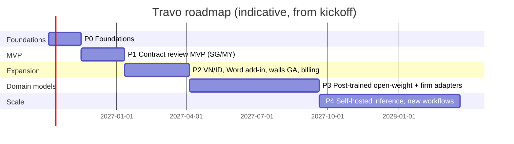

# 12 — Implementation Roadmap

> **Status:** Draft v1 · **Last updated:** 2026-09-29 · **Related:** all specs; progress tracked in `memory/SESSION_LOG.md`
>
> Time-to-market strategy: buy/borrow infrastructure early (managed inference, managed Temporal, managed auth), build only what differentiates (routing policy, legal RAG + validation, playbook workflows, flywheel), and ship to **Singapore/Malaysia design partners first** (English, common law), then add VN/ID.

## Overview

## P0 — Foundations (weeks 0–6)
**Goal:** secure multi-tenant skeleton that can run one agent step end-to-end through the router.
- Monorepo, CI, Terraform for SG cell (dev/staging).
- Auth (OIDC SSO), tenants, users, matters, ethical-wall membership, RLS.
- Document upload, encrypted storage, parsing (DOCX/PDF), clause segmentation v0.
- Router v0: LiteLLM + policy engine (provider allow/deny, per-matter deny, BYO keys, fallback), `RoutingDecision` logging.
- Open-weight endpoint on Fireworks or Baseten; one frontier provider via BYO key.
- Audit log, OpenTelemetry, Langfuse (in-cell).
- Eval harness skeleton + first 30 annotated NDAs.

**Exit criteria:** upload NDA → classify → extract clauses via T1 → results visible; denied provider never called (contract test); cross-tenant access tests pass.

## P1 — Contract Review MVP, SG/MY English (weeks 6–14)
**Goal:** design partners use Travo on real (non-critical) matters.
- `ContractReviewWorkflow` on Temporal with all agents from [05](05-contract-review-workflow.md).
- Starter playbooks: NDA, MSA, SaaS/DPA, distribution (SG, MY).
- Legal RAG: SG + MY public primary law, hybrid search + rerank; Citation Validator v1 + export gate.
- Review canvas UI, findings dispositions with reason codes, redline DOCX + memo export.
- Escalation T1 → T2 with confidence + validator triggers.
- Telemetry events ([07](07-hitl-telemetry-data-flywheel.md) §2); few-shot memory from accepted redlines.
- Admin: model policy editor (basic), BYO keys, spend view.
- Security baseline + external pen test.
- **2–3 design-partner firms** in SG/MY (free pilot → paid conversion terms agreed upfront).

**Exit criteria:** PRD P1 metrics ([01](01-product-vision-and-prd.md) §6) met on golden sets; ≥ 100 real contracts reviewed by partners; finding acceptance ≥ 60% (→ 70% by P2).

## P2 — Regional expansion & enterprise readiness (months 4–6)
- Vietnam + Indonesia jurisdiction packs; VI/ID/MS language support; bilingual alignment and discrepancy detection.
- More contract types: SPA/SHA, facility agreements, leases, employment.
- Word add-in; tabular multi-document review; XLSX export.
- Ethical walls GA with Intapp / iManage / NetDocuments connectors.
- Travo proxy billing (Travo Tokens via OpenRouter-compatible upstream) + usage metering + invoicing.
- Playbook editor v2 with suggestions inbox; "Travo is learning" digest v1.
- VN-local cell (or partner-hosted) and Jakarta cell as needed by customers.
- SOC 2 Type I; ISO 27001 program started.

**Exit criteria:** 3 paying firms, ≥ 150 seats; VN or ID design partner live; inference gross margin ≥ 60%.

## P3 — Travo domain models & firm adapters (months 6–12)
- Post-train Travo legal base (SFT + DPO) on licensed/synthetic/opt-in data; release as T1 default after beating off-the-shelf base on gates.
- Per-firm LoRA adapters from correction data; shadow → canary → promote pipeline; adapter lineage.
- Distillation from T2 escalations; learned routing table (cost/quality per task).
- Litigation research beta (case-law Q&A with validation) for SG/MY.
- SOC 2 Type II, ISO 27001 certification; ISO 42001 readiness.

**Exit criteria:** T2 token share ≤ 25%; firm adapters show ≥ +5 pts acceptance vs base; cost per contract down ≥ 40% vs P1.

## P4 — Scale & sovereignty (months 12–18+)
- Travo-controlled inference clusters (vLLM/SGLang) in SG, plus VN/ID cells; single-tenant/VPC and on-prem appliance.
- New workflows: due-diligence data-room review, drafting from term sheets, regulatory change monitoring, Outlook intake.
- Expansion: Thailand, Philippines, Hong Kong; in-house legal teams.
- Open API / SDK for firms to build their own workflows on Travo agents.

## Team (lean plan)
| Phase | Core team |
|---|---|
| P0–P1 | 1 tech lead/architect, 2 full-stack, 1 ML/LLM engineer, 1 legal engineer (SG/MY qualified lawyer), 1 designer (part-time), founder GTM |
| P2 | + 1 backend, + 1 ML, + VN & ID legal engineers, + security/compliance lead, + customer success |
| P3–P4 | + ML training/infra engineers (GPU ops), + SRE, + sales per country |

## Key risks & mitigations
| Risk | Mitigation |
|---|---|
| Licensed legal data access (MY/SG commercial DBs) | Start with public primary law; pursue partnerships early; let firms connect their own subscriptions where APIs allow. |
| Hallucination incident at a design partner | Export gate, validator, conservative defaults, human disposition required, incident runbook. |
| Open-weight quality insufficient for VN/ID | Escalate more to T2 initially; invest in VN/ID eval sets and post-training in P3. |
| Long enterprise sales cycles | Design-partner program, SG legal-tech grants, transparent usage pricing for mid-size firms. |
| Competitors localise (Harvey/Legora APAC push) | Speed on local law depth, neutrality/BYO keys, pricing, local presence. |
| Regulatory change (VN PDPL decrees, AI laws) | Compliance lead; region cells; policy-driven router. |

## Go-to-market notes
- **SG:** design partners among mid-size local firms and regional offices; partnership with SAL/legal-tech ecosystems `[verify]`.
- **MY:** mid-size commercial firms, English-first; price-sensitive → Travo Tokens bundle.
- **VN:** firms serving FDI clients (bilingual contracts are the killer feature); local hosting option.
- **ID:** firms handling foreign investment; Indonesian-language requirement checks.
